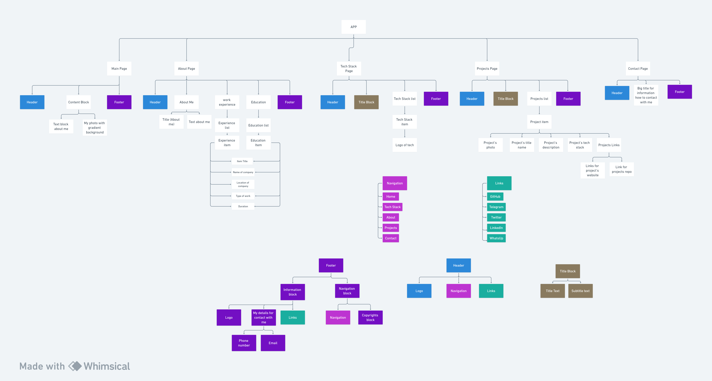

# Individual Portfolio

# About My Portfolio Project

## Planning & Inspiration

### Diagrams

[Link for my components' diagram](https://whimsical.com/individual-portfolio-5pePPa99b54Up9qXFYuWhA)

### Education

1. SEP 2022 – JUN 2023   ESOL | GCSE Math | GCSE English | ICT   London South East College   London
2. SEP 2012 – MAY 2022   Secondary Education | Math | English | Ukrainian | IT   Lysetsky Lyceum   Ukraine
3. SEP 2018 – JUN 2021   Coding | Front-end Developer | Communication Skills   Programming School “School of computer skills”   Ukraine

### Experience

1. JULY 2020 – PRESENT   Front-end Developer | Node.js Developer   Worked on: Freelance   Location: Ukraine, London, USA, Germany
2. JUN 2021 – SEPT 2021   Front-end Developer | Node.js Developer | Node Telegram Bot   Furniture Company: 4 Stiny   Location: Ukraine (Remote, Office)
3. JAN 2022 – APR 2022   Front-end Developer | React Developer | React Native   Sport Company: Easy Champ   Location: Ukraine (Remote), Poland (Remote)

Key responsibilities: I specialize in creating high-quality user interfaces that
provide all necessary functionalities, ensure correct display on all devices, and
offer a convenient interface. In addition, I have experience in writing servers using
Node.js, collaborating effectively with teams, and troubleshooting technical
issues.

### My Tech Stack for portfolio

**Frontend**

-   JavaScript
-   TypeScript
-   ReactJS
-   Redux
-   HTML
-   CSS
-   BootStrap
-   MaterialUI
-   ReactNative
-   GulpJS

**Backend**

-   NodeJS
-   MySQL
-   MongoDB
-   expressJS

**Additional**

-   NPM
-   Yarn
-   Adobe Photoshop
-   Adobe After Effects
-   Adobe Premiere Pro
-   Figma

### Links

[Figma layout for design of my portfolio](<https://www.figma.com/file/HNvizHWHUTJkVd3IR53Ij2/Developer-Portfolio-Design-(Community)?node-id=0%3A1&mode=dev>)

[My current portfolio](https://portfolio-nazar.web.app/)

## Tech Stack

In this project I will use React with vite template of react, also I will use:

-   **react routing** - for make routs in my app
-   **MongoDB** - for create data base where I will store all my projects
-   **NodeJs** - for create end points and api for control all data into database
-   **express js** - for create my server

## Why This Stack

I will use react for create one page web application of my portfolio also I will use mongo db for store all my projects and probably setting and data for my profile, so I will be able to change all titles, descriptions and photos in my app.

Node js and express js I will use for create my server for communication between user interface and database. I will create there a few end points for add a new project in my database, for delete project, edit that project and probably I will create one end point for change all information in my portfolio.

# Links

### Online hosted Portfolio

In progress...

### Portfolio GitHub Repo

https://github.com/NazarTymiv/individual-portfolio-nazar-tymiv
